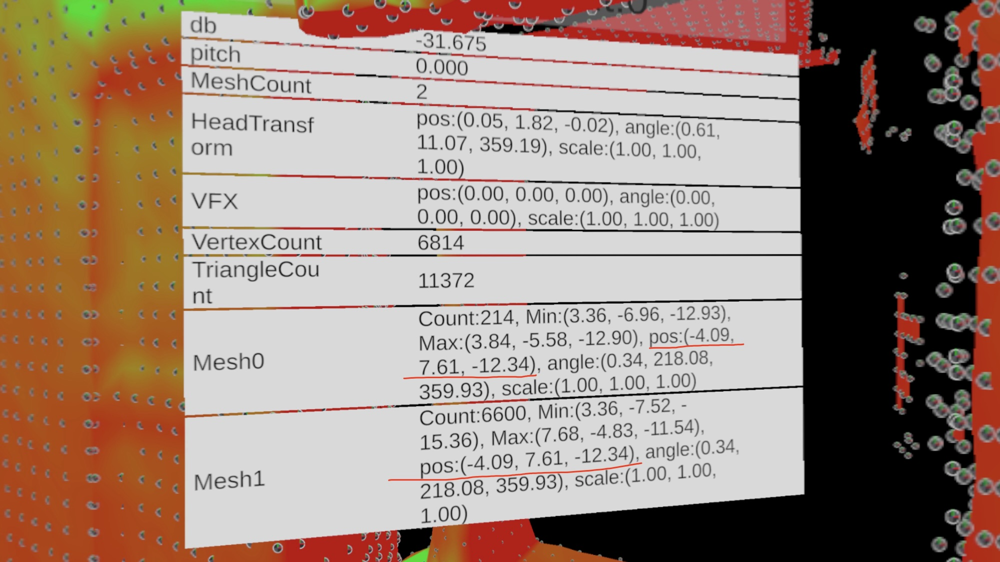

## What is EchoVision

EchoVision is an AR application where users' voices are visually represented in the surrounding environment, simulating the echolocation system of bats. This allows users to experience what it feels like to be a bat.  
EchoVision also serves as a sample project for [HoloKit](https://holokit.io/), an Open-Source Mixed Reality Headset created by Holo Interactive.

## What is EchoVision Pro
EchoVision Pro is the version for Apple Vision Pro

 

## How to play
- Download the app from app store by searching "EchoVision Pro". 
- Start the app and the app will be running in Fully Immersive Mode in which surrounding environment would turn totally black by default.
- Generate voices to see the effects.

 

## How to run
### System Requirements
- Computer: computer with Apple Silicon Chip inside
- Unity Version: 2022.3 for Apple Silicon
- Xcode: 15.2 or newer
- ARFoundation 5

### Project Settings
- Change build target to "VisionOS" in `Project Setting/Player settings`
- Choose "Virtual Reality - Fully Immersive Space" in 'Project Settings/XR Plug-in Management/Apple VisionOS'

 

## Important Note about migration from iOS version
We use ARMeshManager of ARFoundation to generate meshes of surrounding environment. From the actual practice in iOS and the discussions in various posts, the Meshes generated by ARMeshManager should stay at (0,0,0), and the Vertices in the Meshes will be at the actual coordinates.  
However, when using ARMeshManager in VisionPro, the Meshes generated by ARMeshManager all have the same non-zero positions and rotations, which leads to problems when directly using coordinates of Verties in the Meshes to generate effects.  
> Remember to convert the local coordinates to world coordinates first. It has been taken care of in this project.

